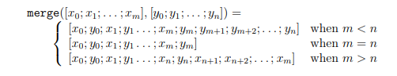

# Gammelt eksamenssæt

## Opgave 1

### **1.1**

**Q**

Declare a function repeatList: ’a list -> int -> ’a list, so that
repeatList xs n = xs @ xs @ · · · @ xs, with n occurrences of xs

**A**

```fsharp
'a list -> int -> 'a list
let rec repeatList xs = function 
                        | 0 -> []
                        | n -> xs @ repeatList xs (n-1);;
```

or

```fsharp
'a list -> int -> 'a list
let rec repeatList xs = function
    | 0 -> []
    | n -> repeatList xs (n-1) @ xs
```

### **1.2**

**Q**

Declare a function merge: ```’a list * ’a list -> ’a list```, so that



That is, the function merge can merge the elements of two lists, where the lists need not
have the same size. For example, merge([1; 2], [3; 4]) = [1; 3; 2; 4], merge([1; 2], [3; 4; 5]) =
[1; 3; 2; 4; 5] and merge([1; 2; 3; 4], [5; 6]) = [1; 5; 2; 6; 3; 4].

**A**

```fsharp
(must be a tuple, otherwise it would be 'a list -> 'a list -> 'a list)

'a list * 'a list -> 'a list
let rec merge (xs, ys) =
    match xs, ys with
    | _,[] -> xs
    | [],_ -> ys
    | xs::xrest, ys::yrest -> [xs;ys] @ merge (xrest, yrest)
```

or

```fsharp
'a list * 'a list -> 'a list
let rec merge (xs, ys) =
    match xs, ys with
    | ([],zs) | (zs,[]) -> zs
    | xs::xrest, ys::yrest -> [xs;ys] @ merge (xrest, yrest)
```

or

```fsharp
'a list * 'a list -> 'a list
let rec merge(xs,ys) = match (xs,ys) with
                       | ([],zs) | (zs,[]) -> zs
                       | (x::xrest,y::yrest) -> x::y::merge(xrest,yrest);;
```

## Opgave 2

Consider the following F# declarations:

```fsharp
let rec f = function
| 0 -> [0]
| i when i>0 -> i::g(i-1)
| _ -> failwith "Negative argument"
and g = function
| 0 -> []
| n -> f(n-1);;

let h s k = seq { for a in s do yield k a };;

let rec sum xs = match xs with
| [] -> 0
| x::rest -> x + sum rest;;
```

### **2.1**

**Q**

Give the values of f 5 and h (seq [1;2;3;4]) (fun i -> i+10). Furthermore, give
the (most general) types for f and h, and describe what each of these two functions
computes. Your description for each function should focus on what it computes, rather
than on individual computation steps.

**A**

f 5 = [5; 3; 1] as can by seen by evaluation

```bash
f 5 evaluates to
5::g 4 evaluates to
5::f 3 evaluates to
5::3::g 2 evaluates to
5::3::f 1 evaluates to
5::3::1::g 0 evaluates to
5::3::1::[]
```

the type of f is int -> int list

**If i is negative** the f i raises an exception <br>
**if i is positive and odd**, then f i = [i; i-2; ....;1] <br>
**otherwise** f i = [i; i-2; ....;0]

h (seq [1;2;3;4]) (fun i -> i+10) = seq [11; 12; 13; 14]

h has type seq<'a> -> ('a -> 'b) -> seq<'b> and

h sq k is the sequence obtained from sq by application of k to every element, that is, the value of h sq k is the same as the value of Seq.map k sq.
